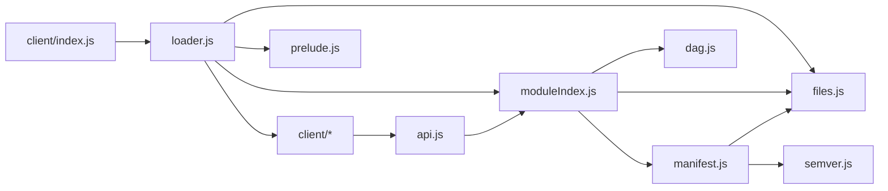

I will not be including the .d.ts files in this repo because they are huge.

To generate them, run [dtsgen](https://github.com/FabricCore/dtsgen) with
config that looks like

```jsonc
{
  "out": "../scripts/types",
  "sources": [
    {
      "jar": "~/.gradle/caches/.../minecraft-merged.jar",
    },
    {
      "jar": "${JAVA_HOME}/jmods/java.base.jmod",
    },
    {
      "jar": "~/.gradle/caches/.../fabric-loader-0.19.3.jar",
    },
    {
      "jar": "fabric-api.jar",
    },
    {
      "jar": "~/.gradle/caches/.../commons-io-2.20.0.jar"
    }
  ],
  "classpathOnly": [],
  "jsdoc": "params",
  "registry": "full",
  "scope": {
    "opaque": [],
    "exclude": [
      "sun.**",
      "jdk.**",
      "com.sun.**",
      "javax.**",
      "java.security.**",
      "java.lang.classfile.**",
      "java.lang.invoke.**",
      "java.lang.module.**",
      "java.lang.ref.**",
      "java.lang.reflect.**",
      "java.nio.channels.**",
      "java.nio.charset.**",
      "net.fabricmc.loader.impl.**",
    ],
  },
}
```

Bootstrap dependency graph


